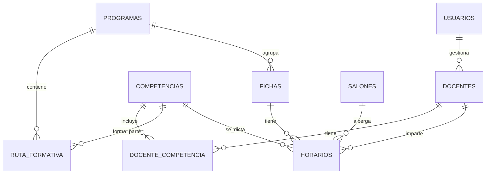

# Sistema de Gestión de Horarios Académicos - SENA
##
## 📋 Índice

1. [Arquitectura del Sistema](#arquitectura-del-sistema)
2. [Diagrama de Base de Datos](#diagrama-de-base-de-datos)
3. [Estructura del Proyecto](#estructura-del-proyecto)
4. [Instalación y Configuración](#instalación-y-configuración)
5. [Uso del Sistema](#uso-del-sistema)
6. [Roles y Permisos](#roles-y-permisos)
7. [Tecnologías Utilizadas](#tecnologías-utilizadas)

---

## 🏗️ Arquitectura del Sistema

### Arquitectura General

El sistema sigue una arquitectura de tres capas con diseño RESTful:

```
┌─────────────────────────────────────────────────────────────┐
│                     FRONTEND (React)                        │
├─────────────────────────────────────────────────────────────┤
│  Components │ Pages │ Hooks │ Services │ Context │ Utils    │
└─────────────────────────────────────────────────────────────┘
                              │
                              │ HTTPS/REST API
                              │
┌─────────────────────────────────────────────────────────────┐
│                      BACKEND (Node.js)                      │
├─────────────────────────────────────────────────────────────┤
│    Routes │ Controllers │ Services │ Models │ Middleware     │
└─────────────────────────────────────────────────────────────┘
                              │
                              │ SQL Queries
                              │
┌─────────────────────────────────────────────────────────────┐
│                  BASE DE DATOS (SQL Server)                 │
└─────────────────────────────────────────────────────────────┘
```

### Flujo de Autenticación

```
1. Usuario inicia sesión → Login Request
2. Backend valida credenciales → JWT Token
3. Almacena token en cliente → LocalStorage/Context
4. Token incluido en headers → API Requests
5. Middleware verifica JWT → Role-based access
6. Respuesta con datos → Renderizado condicional
```

---

## 🗄️ Diagrama de Base de Datos

### Diagrama Entidad-Relación (ER)



### Estructura de Tablas

#### Tabla: `usuarios`
```sql
- id_usuario (INT, PK, IDENTITY)
- username (VARCHAR(50), UNIQUE, NOT NULL)
- password_hash (VARCHAR(255), NOT NULL)
- rol (VARCHAR(20), CHECK('admin', 'coordinador', 'docente'))
- id_docente (INT, FK → docentes.id_docente, NULL)
- fecha_creacion (DATETIME, DEFAULT GETDATE())
- activo (BIT, DEFAULT 1)
```

#### Tabla: `docentes`
```sql
- id_docente (INT, PK, IDENTITY)
- nombre_apellido (VARCHAR(100), NOT NULL)
- numero_documento (VARCHAR(20), UNIQUE, NOT NULL)
- celular (VARCHAR(20))
- correo (VARCHAR(100), UNIQUE)
- fecha_registro (DATETIME, DEFAULT GETDATE())
- activo (BIT, DEFAULT 1)
```

#### Tabla: `competencias`
```sql
- id_competencia (INT, PK, IDENTITY)
- nombre (VARCHAR(200), NOT NULL)
- codigo (VARCHAR(20), UNIQUE)
- duracion_horas (INT)
- fecha_registro (DATETIME, DEFAULT GETDATE())
- activo (BIT, DEFAULT 1)
```

#### Tabla: `docente_competencia`
```sql
- id_docente (INT, FK → docentes.id_docente)
- id_competencia (INT, FK → competencias.id_competencia)
- fecha_asignacion (DATETIME, DEFAULT GETDATE())
- PRIMARY KEY (id_docente, id_competencia)
```

#### Tabla: `programas`
```sql
- id_programa (INT, PK, IDENTITY)
- nombre (VARCHAR(200), NOT NULL)
- codigo (VARCHAR(20), UNIQUE)
- tipo (VARCHAR(20), CHECK('tecnico', 'tecnologia', 'asistente'))
- duracion_trimestres (INT)
- tipo_oferta (VARCHAR(20), CHECK('abierta', 'cerrada', 'encadenamiento'))
- fecha_registro (DATETIME, DEFAULT GETDATE())
- activo (BIT, DEFAULT 1)
```

#### Tabla: `ruta_formativa`
```sql
- id_ruta (INT, PK, IDENTITY)
- id_programa (INT, FK → programas.id_programa)
- id_competencia (INT, FK → competencias.id_competencia)
- trimestre (INT)
- fecha_creacion (DATETIME, DEFAULT GETDATE())
```

#### Tabla: `fichas`
```sql
- id_ficha (INT, PK, IDENTITY)
- codigo (VARCHAR(20), UNIQUE, NOT NULL)
- id_programa (INT, FK → programas.id_programa)
- fecha_inicio (DATE)
- fecha_fin (DATE)
- fecha_registro (DATETIME, DEFAULT GETDATE())
- activo (BIT, DEFAULT 1)
```

#### Tabla: `salones`
```sql
- id_salon (INT, PK, IDENTITY)
- nombre (VARCHAR(50))
- numero (VARCHAR(10))
- capacidad (INT, DEFAULT 30)
- ubicacion (VARCHAR(100))
- fecha_registro (DATETIME, DEFAULT GETDATE())
- activo (BIT, DEFAULT 1)
```

#### Tabla: `horarios`
```sql
- id_horario (INT, PK, IDENTITY)
- dia (VARCHAR(15), CHECK('lunes', 'martes', 'miercoles', 'jueves', 'viernes', 'sabado'))
- hora_inicio (TIME)
- hora_fin (TIME)
- id_docente (INT, FK → docentes.id_docente)
- id_ficha (INT, FK → fichas.id_ficha)
- id_salon (INT, FK → salones.id_salon)
- id_competencia (INT, FK → competencias.id_competencia)
- fecha_registro (DATETIME, DEFAULT GETDATE())
- activo (BIT, DEFAULT 1)
```

---

## 📁 Estructura del Proyecto

### Backend - Node.js/Express

```
backend/
├── src/
│   ├── config/
│   │   ├── database.js
│   │   └── auth.js
│   ├── controllers/
│   │   ├── authController.js
│   │   ├── docentesController.js
│   │   ├── competenciasController.js
│   │   ├── programasController.js
│   │   ├── rutasController.js
│   │   ├── fichasController.js
│   │   ├── salonesController.js
│   │   ├── horariosController.js
│   │   └── dashboardController.js
│   ├── services/
│   │   ├── authService.js
│   │   ├── docentesService.js
│   │   ├── competenciasService.js
│   │   ├── programasService.js
│   │   ├── rutasService.js
│   │   ├── fichasService.js
│   │   ├── salonesService.js
│   │   └── horariosService.js
│   ├── models/
│   │   ├── database.js
│   │   ├── queries.js
│   │   └── procedures.sql
│   ├── routes/
│   │   ├── auth.js
│   │   ├── docentes.js
│   │   ├── competencias.js
│   │   ├── programas.js
│   │   ├── rutas.js
│   │   ├── fichas.js
│   │   ├── salones.js
│   │   ├── horarios.js
│   │   └── dashboard.js
│   ├── middleware/
│   │   ├── auth.js
│   │   ├── role.js
│   │   └── error.js
│   ├── utils/
│   │   ├── validators.js
│   │   └── formatters.js
│   └── app.js
├── server.js
├── package.json
├── .env.example
└── README.md
```

### Frontend - React

```
frontend/
├── src/
│   ├── components/
│   │   ├── common/
│   │   │   ├── Layout.jsx
│   │   │   ├── Sidebar.jsx
│   │   │   ├── Navbar.jsx
│   │   │   ├── PrivateRoute.jsx
│   │   │   └── RoleGuard.jsx
│   │   ├── auth/
│   │   │   └── LoginForm.jsx
│   │   ├── dashboard/
│   │   │   ├── DashboardAdmin.jsx
│   │   │   ├── DashboardCoordinador.jsx
│   │   │   └── DashboardDocente.jsx
│   │   ├── docentes/
│   │   │   ├── DocenteList.jsx
│   │   │   ├── DocenteForm.jsx
│   │   │   └── DocenteDetail.jsx
│   │   ├── fichas/
│   │   │   ├── FichaList.jsx
│   │   │   └── FichaForm.jsx
│   │   ├── programas/
│   │   │   ├── ProgramaList.jsx
│   │   │   └── ProgramaForm.jsx
│   │   ├── competencias/
│   │   │   ├── CompetenciaList.jsx
│   │   │   └── CompetenciaForm.jsx
│   │   ├── rutas/
│   │   │   ├── RutaList.jsx
│   │   │   └── RutaForm.jsx
│   │   ├── salones/
│   │   │   ├── SalonList.jsx
│   │   │   └── SalonForm.jsx
│   │   ├── horarios/
│   │   │   ├── HorarioList.jsx
│   │   │   ├── HorarioForm.jsx
│   │   │   └── HorarioCalendar.jsx
│   │   └── ui/
│   │       ├── Button.jsx
│   │       ├── Input.jsx
│   │       ├── Table.jsx
│   │       ├── Modal.jsx
│   │       ├── Select.jsx
│   │       └── Card.jsx
│   ├── pages/
│   │   ├── Login.jsx
│   │   ├── Dashboard.jsx
│   │   ├── Docentes.jsx
│   │   ├── Fichas.jsx
│   │   ├── Programas.jsx
│   │   ├── Competencias.jsx
│   │   ├── Rutas.jsx
│   │   ├── Salones.jsx
│   │   └── Horarios.jsx
│   ├── hooks/
│   │   ├── useAuth.js
│   │   ├── useApi.js
│   │   └── useRole.js
│   ├── services/
│   │   ├── api.js
│   │   ├── authService.js
│   │   └── endpoints.js
│   ├── context/
│   │   └── AuthContext.jsx
│   ├── styles/
│   │   ├── globals.css
│   │   └── sena-theme.css
│   ├── utils/
│   │   ├── constants.js
│   │   ├── helpers.js
│   │   └── validators.js
│   ├── App.jsx
│   └── index.js
├── public/
├── package.json
└── README.md
```

---

## 🚀 Instalación y Configuración

### Requisitos Previos

- Node.js (v16 o superior)
- npm o yarn
- SQL Server 2019 o superior
- SQL Server Management Studio (SSMS)

### 1. Configuración de Base de Datos

#### Crear Base de Datos

```sql
-- Conéctate a SQL Server y ejecuta:
CREATE DATABASE SENA_Horarios;
GO

USE SENA_Horarios;
GO
```

#### Ejecutar Scripts SQL

1. Abre SQL Server Management Studio
2. Conéctate a tu servidor
3. Abre el archivo `database/scripts/schema.sql`
4. Ejecuta todo el script para crear las tablas
5. Abre el archivo `database/scripts/data.sql`
6. Ejecuta el script para insertar datos iniciales

### 2. Configuración del Backend

#### Instalar Dependencias

```bash
cd backend
npm install
```

#### Configurar Variables de Entorno

```bash
cp .env.example .env
```

Edita el archivo `.env` con tus configuraciones:

```env
# Puerto del servidor
PORT=5000

# Base de datos
DB_SERVER=localhost
DB_DATABASE=SENA_Horarios
DB_USER=tu_usuario
DB_PASSWORD=tu_contraseña
DB_PORT=1433

# JWT
JWT_SECRET=tu_secreto_jwt_muy_seguro
JWT_EXPIRES_IN=7d

# CORS
FRONTEND_URL=http://localhost:3000
```

#### Iniciar el Servidor

```bash
# Modo desarrollo
npm run dev

# Modo producción
npm start
```

El servidor estará disponible en: `http://localhost:5000`

### 3. Configuración del Frontend

#### Instalar Dependencias

```bash
cd frontend
npm install
```

#### Configurar Variables de Entorno

```bash
cp .env.example .env
```

Edita el archivo `.env`:

```env
REACT_APP_API_URL=http://localhost:5000/api
```

#### Iniciar la Aplicación

```bash
npm start
```

La aplicación estará disponible en: `http://localhost:3000`

---

## 👥 Roles y Permisos

### Usuario Administrador

**Credenciales por defecto:**
- Username: `admin`
- Password: `admin123`

**Permisos:**
- ✅ CRUD completo en todas las entidades
- ✅ Acceso a dashboard con todos los filtros
- ✅ Gestión de usuarios
- ✅ Visualización de reportes

### Usuario Coordinador

**Credenciales por defecto:**
- Username: `coordinador`
- Password: `coord123`

**Permisos:**
- ✅ Ver todas las entidades
- ✅ Editar registros existentes
- ❌ No puede crear ni eliminar
- ✅ Acceso a dashboard con filtros limitados

### Usuario Docente

**Credenciales por defecto:**
- Username: `docente`
- Password: `docente123`

**Permisos:**
- ✅ Ver su información personal
- ✅ Ver fichas asociadas
- ✅ Ver su horario asignado
- ❌ No puede ver información de otros docentes
- ❌ No puede editar información

---

## 🎨 Diseño Visual

### Paleta de Colores (OBLIGATORIA)

```css
:root {
  --sena-primary: #005a32;      /* Verde oscuro - navbar, headers, sidebar */
  --sena-secondary: #04b457;    /* Verde claro - botones, acciones, estados activos */
  --sena-neutral: #c2c2c2;      /* Gris - bordes, fondos secundarios, tablas */
  --sena-base: #ffffff;         /* Blanco - fondos principales */
  --sena-text: #333333;         /* Texto principal */
  --sena-text-light: #666666;   /* Texto secundario */
}
```

### Componentes Principales

#### Navbar
- Color de fondo: `#005a32`
- Color de texto: `#ffffff`
- Altura: 60px
- Sombra: 0 2px 4px rgba(0,0,0,0.1)

#### Sidebar
- Color de fondo: `#005a32`
- Color de texto: `#ffffff`
- Ancho: 250px
- Hover: `rgba(4, 180, 87, 0.2)`

#### Botones

**Botón Primario:**
- Background: `#04b457`
- Color: `#ffffff`
- Border-radius: 6px
- Padding: 10px 20px
- Hover: `#039a4a`

**Botón Secundario:**
- Background: transparent
- Color: `#005a32`
- Border: 1px solid `#005a32`
- Hover: `rgba(0, 90, 50, 0.1)`

#### Tablas
- Header background: `#005a32`
- Header color: `#ffffff`
- Border: 1px solid `#c2c2c2`
- Row hover: `#f5f5f5`

---

## 📊 Funcionalidades del Dashboard

### Filtros Disponibles

1. **Por Docente:** Busca por nombre o documento
2. **Por Ficha:** Busca por código de ficha
3. **Por Salón:** Busca por nombre o número
4. **Por Horario:** Filtra por día y rango de horas

### Visualizaciones

#### Vista Docente
- Datos personales completos
- Horarios asignados
- Competencias que imparte
- Salones donde dicta clases

#### Vista Salón
- Docente asignado en cada horario
- Fichas programadas
- Competencias dictadas
- Horario completo del salón

#### Vista Ficha
- Salón asignado
- Docente de cada competencia
- Horario completo de la ficha
- Ruta formativa

#### Vista Horario
- Número de fichas activas
- Docentes asignados
- Salones ocupados
- Disponibilidad de espacios

---

## 🔧 Tecnologías Utilizadas

### Backend
- **Node.js** - Entorno de ejecución
- **Express.js** - Framework web
- **jsonwebtoken** - Autenticación JWT
- **bcryptjs** - Hashing de contraseñas
- **mssql** - Cliente SQL Server
- **cors** - Control de CORS
- **dotenv** - Variables de entorno
- **joi** - Validación de datos

### Frontend
- **React** - Librería UI
- **React Router** - Enrutamiento
- **Axios** - Cliente HTTP
- **Context API** - Estado global
- **CSS Modules** - Estilos
- **React Hook Form** - Formularios
- **React Query** - Caché y estado del servidor

### Base de Datos
- **SQL Server 2019+** - Motor de base de datos
- **T-SQL** - Lenguaje de consultas

---

## 📦 Scripts de Base de Datos

Los scripts completos se encuentran en:
- `database/scripts/schema.sql` - Estructura de tablas
- `database/scripts/data.sql` - Datos iniciales
- `database/scripts/procedures.sql` - Procedimientos almacenados

---

## 🔐 Seguridad

### Autenticación
- JWT con expiración configurable
- Refresh tokens (opcional)
- Almacenamiento seguro en cliente

### Autorización
- Middleware de roles
- Control de permisos por endpoint
- Validación en frontend y backend

### Encriptación
- Contraseñas hasheadas con bcrypt
- HTTPS en producción
- Headers de seguridad

---

## 🧪 Testing

Para ejecutar las pruebas:

```bash
# Backend
cd backend
npm test

# Frontend
cd frontend
npm test
```

---

## 📈 Escalabilidad

El sistema está diseñado para ser escalable:

- **Horizontal:** Balanceo de carga con PM2
- **Vertical:** Optimización de consultas SQL
- **Caché:** Redis para sesiones y datos frecuentes
- **CDN:** Assets estáticos en producción

---

## 📝 Notas Importantes

1. El sistema utiliza horario colombiano (UTC-5)
2. Todos los registros tienen soft delete (campo `activo`)
3. Las contraseñas deben tener mínimo 6 caracteres
4. Los horarios se manejan en formato 24 horas
5. El sistema valida cruces de horarios automáticamente

---

## 🤝 Contribuciones

Para contribuir al proyecto:

1. Fork del repositorio
2. Crear rama feature/
3. Commit de cambios
4. Push a la rama
5. Pull Request

---

## 📄 Licencia

Este proyecto está diseñado para uso educativo del SENA.

---

## 👨‍💻 Soporte

Para soporte técnico contactar al equipo de desarrollo.

---

**Desarrollado con ❤️ para el SENA**